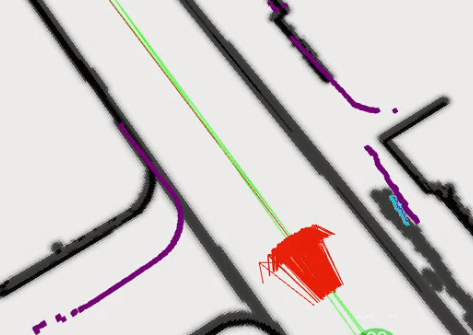

# amclのパラメータ調整方法_1

重要なのは`odom_alpha1`~`odom_alpha4`で, このパラメータがデフォルトのままでは自己位置が破綻することが多いです.    
ここでは端的にそれらのパラメータの意味を説明し, その調整方法を述べます.  

---

## パラメータの説明

### `odom_alpha1`
- **意味**: ロボットの動きの回転成分から予想される回転推定におけるノイズ *(default: 0.2)*

### `odom_alpha2`
- **意味**: ロボットの動きの並進成分から予想される回転推定におけるノイズ *(default: 0.2)*

### `odom_alpha3`
- **意味**: ロボットの動きの並進成分から予想される並進推定におけるノイズ *(default: 0.2)*

### `odom_alpha4`
- **意味**: ロボットの動きの回転成分から予想される並進推定におけるノイズ *(default: 0.2)*

---

## 調整方法

### 1. rosbagの記録
まず, navigation開始時に`rosbag`を記録します. このとき, 上記パラメータはデフォルト値, もしくはそれ以上の値に設定してください. 

```bash
$ rosbag record -a
```

自己位置が破綻したら, `Ctrl+C`で記録を終了します.  

---

### 2. Rvizでパーティクルの散らばり等を確認
Rvizを使用して, パーティクルの散らばりや自己位置のずれ方を確認します. これにより, どのパラメータに問題があるかをある程度予想します.  

#### コマンド例:
##### 過去のデータを再生して確認
- 過去のデータをそのまま確認します
```bash
# 端末1
$ roscore

# 端末2
$ cd ~/catkin_ws/src/orne-box/orne_box_navigation_executor/rviz_cfg
$ rviz -d nav.rviz

# 端末3
$ rosbag play rosbagファイル名
```

##### オフラインで自己位置推定を行って確認
- 上記の方法とは異なり, パラメータを実際に変更しながらパーティクルの変化を確認することができます  
- 下記の[only_localization.launch](https://github.com/YuseiShiozawa/orne-box/blob/test4/orne_box_navigation_executor/launch/only_localization.launch)は私が適当に作った, localizaion(amcl, emcl, emcl2のいずれか)とRvizを同時に立ち上げるものです. 割と便利な気がするのでコピペして活用してください 
  - amclとRvizが立ち上がればなんでもいいです
```bash
# 端末1
$ roslaunch orne_box_navigation_executor only_localization.launch 

# 端末2
$ rosbag play rosbagファイル名 --topics /tf /tf_static /scan
```


---

### 3. 問題の特定とパラメータ調整

#### a. 縦方向のずれ
以下の図のように縦方向にずれている場合, `odom_alpha3`の値を調整します.    
ずれていても正しい位置に復帰できれば問題ありませんが, 根本的な解決を目指すべきです.  

- 具体的には, `odom_alpha3`の値を大きくしていきます. (0.05 ~ 0.1ずつ)  
- おそらくこのような縦方向のずれが発生する場合は, 他の箇所でも複数似たようなことが起きると思います
  - 値を徐々に大きくし, 縦方向のずれが発生する箇所が減ることを確認してください  
  - 発生する箇所を0にするのはかなり難しいと思います
  - できる限り減らしましょう   



#### b. 回転方向のずれ
以下の図のように回転方向にずれている場合,

#### c. 正しい位置に復帰するまでに時間がかかるor復帰しない
以下の図のように正しい位置に復帰しない場合, `update_min_d`, `update_min_a`を調整します. ここを調整する前に[a. 縦方向のずれ](#a-縦方向のずれ), [b. 回転方向のずれ](#b-回転方向のずれ)の調整を先に済ませることをオススメします. 


---

